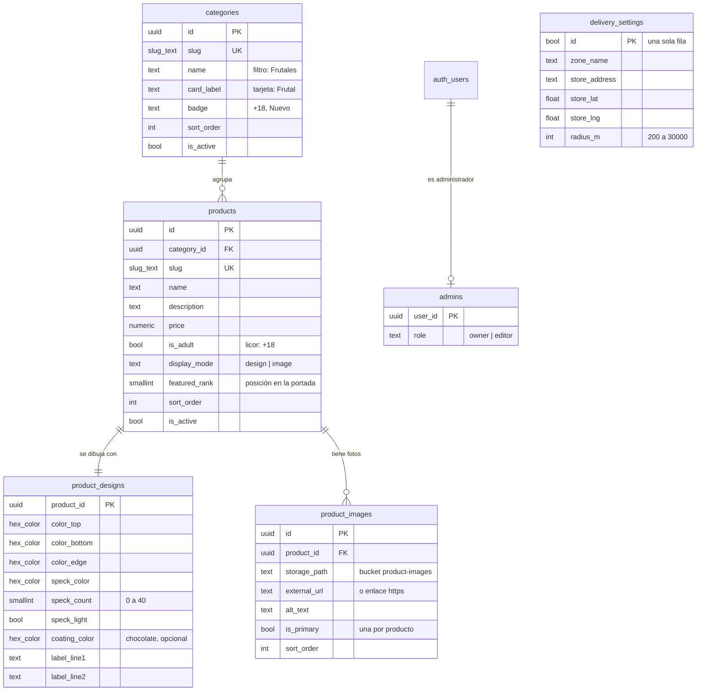

# CHUP Fruit

Tienda de chupetes artesanales (Tingo María) con **catálogo administrable**: productos, categorías, diseño 3D de cada
chupete y fotos se editan desde un panel con login y se guardan en **Supabase**. Todo es frontend estático
(GitHub Pages), sin servidor propio.

- Tienda: `/` (`index.html`)
- Panel administrativo: `/admin/`

## Modelo de datos



Reglas que cuida la base (no solo el frontend):

| Regla | Cómo |
|---|---|
| Colores válidos `#rrggbb` y slugs `a-z0-9-` | dominios `hex_color` y `slug_text` |
| Todo producto tiene diseño | trigger `products_default_design` (1:1) |
| Una sola foto principal por producto | índice único parcial + RPC `set_primary_product_image` |
| No se borra una categoría con productos | FK `on delete restrict` |
| Cada foto viene de Storage **o** de un enlace | `check (num_nonnulls(storage_path, external_url) = 1)` |
| El público solo ve lo activo | RLS: productos activos de categorías activas |
| Solo los administradores escriben | RLS con `is_admin()` en tablas y en el bucket |

Archivos: [`supabase/migrations/…_catalog_schema.sql`](supabase/migrations/20260930000001_catalog_schema.sql) (esquema, RLS,
bucket) y [`…_seed_catalog.sql`](supabase/migrations/20260930000002_seed_catalog.sql) (las 4 categorías y los 16 sabores que
ya tenía la tienda, con sus diseños originales). Ambos se pueden ejecutar más de una vez.

## Poner en marcha Supabase

1. **Crear las tablas y cargar los sabores.** En Supabase → *SQL Editor*, ejecuta en orden:
   1. `supabase/migrations/20260930000001_catalog_schema.sql`
   2. `supabase/migrations/20260930000002_seed_catalog.sql`
   3. `supabase/migrations/20261002000001_delivery_settings.sql` (zona de reparto)

   (Con la CLI: `supabase link --project-ref ecktnooenujqsxfqfidz` y `supabase db push`.)
2. **Conectar la web.** En `js/core/config.js` pega la clave **publicable** (Project Settings → API Keys →
   `sb_publishable_…`) en `SUPABASE_PUBLISHABLE_KEY`. La URL del proyecto ya está puesta.
   > Nunca pongas la clave secreta (`sb_secret_…`) en el frontend: da acceso total y salta la RLS.
3. **Crear tu usuario administrador.** Authentication → Users → *Add user* (correo y contraseña, marcando
   *Auto Confirm User*). Luego, en el SQL Editor:
   ```sql
   insert into public.admins (user_id, role)
   select id, 'owner' from auth.users where email = 'tu-correo@ejemplo.com';
   ```
4. **Recomendado:** Authentication → Sign In / Providers → desactiva *Allow new users to sign up*. Aunque alguien se
   registre, sin fila en `admins` no puede escribir nada, pero así ni siquiera se crean cuentas.
5. Publica (push a la rama de GitHub Pages) y entra a `https://chup-fruit.chaskysoft.org/admin/`.

Mientras la clave no esté configurada o Supabase no responda, la tienda sigue funcionando con el catálogo original
embebido (`js/shared/catalog/catalog.seed.js`), así que nunca queda vacía.

## Arquitectura del frontend

JavaScript con **módulos ES nativos**, sin compilación. Cada funcionalidad es un módulo con sus capas **MVC**; el
acceso a datos está detrás de repositorios (puertos/adaptadores), y cada `main.js` es la raíz de composición que crea
los módulos e inyecta sus dependencias.

```
index.html                 tienda (marcado)
admin/index.html           panel (marcado)
css/
  tokens.css               colores y sombras de la marca (tienda + panel)
  popsicle.css             chupete 3D (tienda + vista previa del panel)
  store.css | admin.css
js/
  core/                    config, fetch a la Data API, cliente supabase-js, DOM, localStorage, imágenes
  shared/
    catalog/               entidades (fila ⇄ objeto) y catálogo de respaldo
    popsicle/              vista del chupete 3D a partir de product_designs
  store/                   TIENDA
    main.js
    modules/
      catalog/   repository · model · view · controller   (Supabase → caché → respaldo)
      order/     model · view · controller                (pedido en pasos, WhatsApp)
      history/   model · view · controller                (mis pedidos en el dispositivo)
      delivery/  repository · model · view · controller   (zona de reparto y mapa)
      layout/    model · view · controller                (scroll, menú, animaciones)
  admin/                   PANEL
    main.js
    ui/                    avisos, confirmación, pestañas, íconos
    modules/
      auth/        model · view · controller              (login + verificación is_admin)
      categories/  repository · model · view · controller
      products/    repository · model · view · controller (lista + editor)
      designer/    model · view · controller              (diseño 3D con vista previa en vivo)
      images/      repository · model · view · controller (subida a Storage, foto principal)
      zone/        repository · model · view · controller (zona de reparto en el mapa)
```

- **Model**: estado y reglas del negocio, sin DOM. Emite `change` para que el controlador repinte.
- **Repository**: único lugar que habla con Supabase (la tienda usa `fetch` a la Data API para no cargar
  supabase-js en el celular del cliente; el panel usa supabase-js para Auth, escritura y Storage).
- **View**: solo pinta y lee el DOM.
- **Controller**: conecta eventos del usuario con el modelo y la vista.

**Zona de reparto:** se configura en el panel (pestaña *Zona*: pin de la tienda, radio, nombre y dirección). Un pedido
con ubicación fuera del círculo **no se bloquea**: el cliente ve un aviso y el mensaje de WhatsApp indica que hay que
coordinar el envío (con la distancia a la tienda).

La tienda guarda en `localStorage` la última respuesta buena de Supabase: en las visitas siguientes pinta al instante y
revalida en segundo plano.

## Desarrollo local

Los módulos ES necesitan servirse por HTTP (no `file://`):

```bash
npx serve .          # o: python3 -m http.server 8000
```
